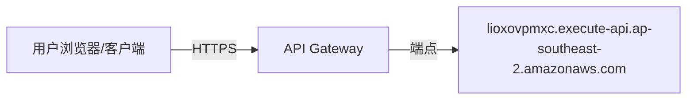
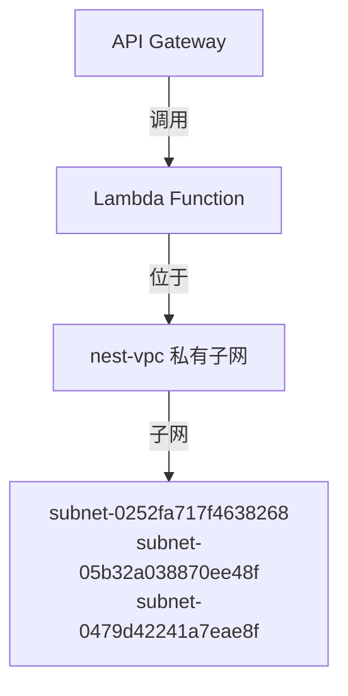
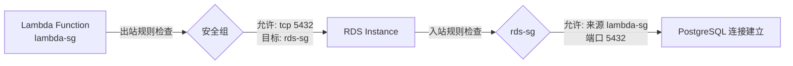
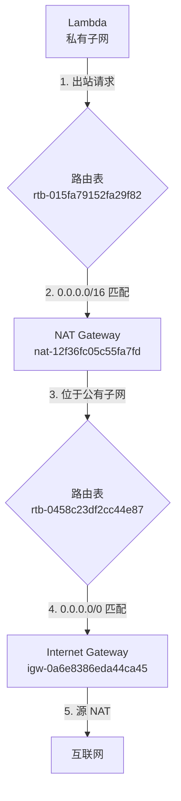
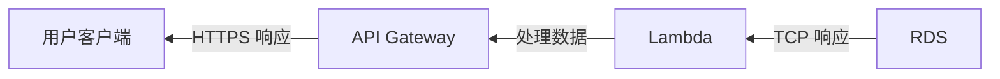

# SAM AWS NestJS Backend

基于 AWS Lambda 的 NestJS 后端服务，运行在 nest-vpc 私有网络中。

## 架构概览

```
Internet → API Gateway → Lambda (nest-vpc) → RDS (nest-vpc)
                ↓
           NAT Gateway → Internet
```

## VPC 网络架构

### VPC 配置

- **VPC**: nest-vpc (`vpc-00b91951c36f803c6`)
- **CIDR**: 10.0.0.0/24
- **Region**: ap-southeast-2 (Sydney)

### 子网划分

#### 公有子网
| 子网ID | 可用区 | CIDR | 用途 |
|--------|--------|------|------|
| subnet-0c3469f644fe8631c | ap-southeast-2a | 10.0.0.0/28 | NAT Gateway, 公网访问 |

#### 私有子网 (Lambda 运行环境)
| 子网ID | 可用区 | CIDR | 用途 |
|--------|--------|------|------|
| subnet-0252fa717f4638268 | ap-southeast-2a | 10.0.0.16/28 | Lambda 函数 |
| subnet-05b32a038870ee48f | ap-southeast-2b | 10.0.0.32/28 | Lambda 函数 |
| subnet-0479d42241a7eae8f | ap-southeast-2c | 10.0.0.48/28 | Lambda 函数 |

### 网关和路由

#### Internet Gateway
- **ID**: igw-0a6e8386eda44ca45
- **用途**: 提供 VPC 与互联网的连接

#### NAT Gateway
- **ID**: nat-12f36fc05c55fa7fd
- **位置**: 公有子网 (subnet-0c3469f644fe8631c)
- **用途**: 允许私有子网中的资源访问互联网

#### 路由表

**公有子网路由表** (rtb-0458c23df2cc44e87)
```
目标           下一跳
10.0.0.0/24    local
0.0.0.0/0      igw-0a6e8386eda44ca45
```

**私有子网路由表** (rtb-015fa79152fa29f82)
```
目标           下一跳
10.0.0.0/24    local
0.0.0.0/16     nat-12f36fc05c55fa7fd
```

### 安全组

#### Lambda 安全组 (lambda-sg)
- **ID**: sg-03f70a4888769b78c
- **出站规则**:
  - 目标: sg-0fc391d30ffe29141 (rds-sg), 端口: 5432 (PostgreSQL)
  - 目标: 0.0.0.0/0, 协议: All (访问互联网)

#### RDS 安全组 (rds-sg)
- **ID**: sg-0fc391d30ffe29141
- **入站规则**:
  - 来源: sg-03f70a4888769b78c (lambda-sg), 端口: 5432
  - 来源: 0.0.0.0/0, 端口: 5432 (管理访问)
- **出站规则**:
  - 目标: 0.0.0.0/0, 协议: All

## 完整请求流程

### 1. 用户请求 → API Gateway



**流程**:
1. 用户从互联网发送 HTTPS 请求到 API Gateway
2. API Gateway 端点: `https://lioxovpmxc.execute-api.ap-southeast-2.amazonaws.com`
3. API Gateway 接收请求并进行路由匹配

### 2. API Gateway → Lambda (VPC 内)



**流程**:
1. API Gateway 通过 AWS 内部网络调用 Lambda 函数
2. Lambda 函数运行在 nest-vpc 的私有子网中（3个可用区实现高可用）
3. Lambda 的 ENI (弹性网络接口) 附加到私有子网，获得私有 IP 地址

**安全组检查**: Lambda 的出站流量受 `lambda-sg` 安全组控制

### 3. Lambda → RDS 数据库



**详细流程**:

#### 出站流量 (Lambda → RDS)
1. **Lambda 发起连接**:
   - 源 IP: Lambda ENI 的私有 IP (10.0.0.x)
   - 目标 IP: database-nest.c7c448egsa7a.ap-southeast-2.rds.amazonaws.com
   - 目标端口: 5432
   - 协议: TCP

2. **路由查找**:
   - 查询私有子网路由表 (rtb-015fa79152fa29f82)
   - 目标 IP 属于 10.0.0.0/24 (VPC 内部)
   - 匹配路由: `10.0.0.0/24 → local`
   - 流量在 VPC 内部路由

3. **lambda-sg 出站规则检查**:
   ```
   规则 1: 目标=sg-0fc391d30ffe29141, 协议=TCP, 端口=5432 ✓ 匹配
   规则 2: 目标=0.0.0.0/0, 协议=All ✓ 也匹配（更宽泛）
   ```
   - 允许流量离开 Lambda

#### 入站流量 (RDS 接收)
4. **rds-sg 入站规则检查**:
   ```
   规则 1: 来源=sg-03f70a4888769b78c (lambda-sg), 端口=5432 ✓ 匹配
   ```
   - 允许流量进入 RDS

5. **TCP 连接建立**:
   - 三次握手完成
   - PostgreSQL 协议握手
   - Lambda 现在可以执行 SQL 查询

#### 返回流量 (RDS → Lambda)
6. **rds-sg 出站规则**:
   ```
   规则: 目标=0.0.0.0/0, 协议=All ✓ 允许所有出站
   ```

7. **lambda-sg 入站规则**:
   - 由于这是已建立连接的返回流量，自动允许（有状态防火墙）

### 4. Lambda → 外部服务 (通过 NAT Gateway)

当 Lambda 需要访问外部服务（如 AWS API、第三方 API）时：



**详细流程**:

1. **Lambda 发起外部请求**:
   - 例如: `https://api.anthropic.com`
   - 源 IP: 10.0.0.x (私有 IP)
   - 目标 IP: 公网 IP

2. **私有子网路由查找**:
   - 查询路由表 rtb-015fa79152fa29f82
   - 目标不在 10.0.0.0/24 范围内
   - 匹配路由: `0.0.0.0/16 → nat-12f36fc05c55fa7fd`

3. **流量发送到 NAT Gateway**:
   - NAT Gateway 位于公有子网 (subnet-0c3469f644fe8631c)
   - NAT Gateway 有自己的弹性 IP (公网 IP)

4. **NAT 地址转换**:
   - 源 IP 替换: 10.0.0.x → NAT Gateway 的公网 IP
   - 源端口记录: 用于返回流量

5. **公有子网路由查找**:
   - 查询路由表 rtb-0458c23df2cc44e87
   - 匹配路由: `0.0.0.0/0 → igw-0a6e8386eda44ca45`

6. **Internet Gateway**:
   - 流量通过 IGW 发送到互联网
   - 外部服务看到的源 IP 是 NAT Gateway 的公网 IP

7. **返回流量**:
   - 互联网 → IGW → NAT Gateway
   - NAT Gateway 根据端口映射表还原原始的私有 IP
   - NAT Gateway → Lambda (10.0.0.x)

### 5. 响应返回



## 完整的网络流量矩阵

### 入站流量规则汇总

| 源 | 目标 | 协议/端口 | 安全组规则 | 允许/拒绝 |
|---|------|----------|-----------|----------|
| 互联网 | API Gateway | HTTPS/443 | AWS 托管 | ✓ 允许 |
| API Gateway | Lambda | AWS 内部 | AWS 托管 | ✓ 允许 |
| Lambda (lambda-sg) | RDS (rds-sg) | TCP/5432 | rds-sg 入站规则 | ✓ 允许 |
| 互联网 | Lambda | - | 无规则 | ✗ 拒绝 (私有子网) |
| 互联网 | RDS | TCP/5432 | rds-sg 入站规则 | ✓ 允许 (管理访问) |

### 出站流量规则汇总

| 源 | 目标 | 协议/端口 | 安全组规则 | 路由 |
|---|------|----------|-----------|------|
| Lambda | RDS | TCP/5432 | lambda-sg 出站规则 | VPC local |
| Lambda | 互联网 | All | lambda-sg 出站规则 | NAT Gateway |
| RDS | Any | All | rds-sg 出站规则 | 根据目标路由 |

## 部署配置

### SAM Template 参数

```yaml
Parameters:
  VpcId: vpc-00b91951c36f803c6
  LambdaSubnetIds:
    - subnet-0252fa717f4638268
    - subnet-05b32a038870ee48f
    - subnet-0479d42241a7eae8f
  DatabaseSecurityGroupId: sg-0fc391d30ffe29141
```

### 数据库连接

```
DatabaseUrl: postgresql://<DB_USER>:<DB_PASSWORD>@database-nest.c7c448egsa7a.ap-southeast-2.rds.amazonaws.com:5432/sam_aws_nest?schema=public
```

## 构建和部署

### 本地构建

```bash
# 安装依赖
npm install

# 构建 Lambda 函数
sam build

# 部署到生产环境
sam deploy --config-env prod \
  --parameter-overrides "DatabaseUrl=$DATABASE_URL VpcId=vpc-00b91951c36f803c6 LambdaSubnetIds=subnet-0252fa717f4638268,subnet-05b32a038870ee48f,subnet-0479d42241a7eae8f DatabaseSecurityGroupId=sg-0fc391d30ffe29141"
```

部署完成后执行 Prisma 迁移（会自动创建 `DATABASE_URL` 里指定的数据库，如果不存在）：

```bash
FUNCTION_NAME="$(aws cloudformation describe-stacks \
  --stack-name sam-aws-nest-backend-prod \
  --region ap-southeast-2 \
  --query "Stacks[0].Outputs[?OutputKey=='MigrationFunctionName'].OutputValue" \
  --output text)"
aws lambda invoke \
  --function-name "$FUNCTION_NAME" \
  --payload '{}' \
  --cli-binary-format raw-in-base64-out \
  /tmp/migrate.json
cat /tmp/migrate.json
```

### Makefile 构建流程

```makefile
build-BackendFunction:
	npm install --include=dev --no-fund --no-audit
	npm exec prisma generate              # 生成 Prisma 客户端
	npm run build                         # 构建 NestJS 应用
	npm prune --omit=dev                  # 删除开发依赖
	mkdir -p $(ARTIFACTS_DIR)
	cp -R dist/* $(ARTIFACTS_DIR)         # 复制编译产物
	cp -R node_modules $(ARTIFACTS_DIR)   # 复制生产依赖
	cp package.json $(ARTIFACTS_DIR)
	mkdir -p $(ARTIFACTS_DIR)/prisma
	cp prisma/schema.prisma $(ARTIFACTS_DIR)/prisma/schema.prisma
	cp -R prisma/migrations $(ARTIFACTS_DIR)/prisma/migrations
```

### CI/CD (GitHub Actions)

工作流文件: `.github/workflows/deploy-backend-prod.yml`

触发部署:
1. Push 代码到 `main` 分支，或
2. 在 GitHub Actions 页面手动触发 "Deploy Backend (prod)"

## 安全性考虑

### 网络隔离
- ✓ Lambda 运行在私有子网，无法从互联网直接访问
- ✓ 所有外部访问必须通过 API Gateway
- ✓ RDS 在同一 VPC 内，通过安全组隔离

### 最小权限原则
- ✓ Lambda 只能访问必需的 RDS 端口 (5432)
- ✓ 安全组使用引用方式（sg-xxx），而非 CIDR，更安全
- ✓ NAT Gateway 确保出站流量使用固定公网 IP

### 数据加密
- ✓ API Gateway 强制 HTTPS
- ✓ Lambda 到 RDS 的连接可启用 SSL
- ✓ 数据库密码通过 AWS Secrets Manager 或环境变量加密传递

## 监控和日志

### CloudWatch 日志组
- Lambda 函数日志: `/aws/lambda/sam-aws-nest-backend-prod-BackendFunction-YPMWqxApxDuw`
- API Gateway 日志: 通过 CloudWatch 查看

### 查看日志

```bash
# 查看最近 10 分钟的 Lambda 日志
aws logs tail /aws/lambda/sam-aws-nest-backend-prod-BackendFunction-YPMWqxApxDuw --since 10m --format short

# 查看所有 Lambda 函数
aws lambda list-functions --query 'Functions[?contains(FunctionName, `sam-aws-nest-backend-prod`)].FunctionName'
```

## 故障排除

### Lambda 无法连接 RDS

检查清单:
1. ✓ Lambda 和 RDS 在同一 VPC？
2. ✓ lambda-sg 允许出站到 5432 端口？
3. ✓ rds-sg 允许来自 lambda-sg 的入站 5432？
4. ✓ DATABASE_URL 正确？

### Lambda 无法访问互联网

检查清单:
1. ✓ Lambda 在私有子网？
2. ✓ 私有子网路由表指向 NAT Gateway？
3. ✓ NAT Gateway 状态为 available？
4. ✓ NAT Gateway 位于公有子网？
5. ✓ 公有子网路由表指向 Internet Gateway？
6. ✓ lambda-sg 允许出站到 0.0.0.0/0？

### Prisma 客户端未生成

错误: `@prisma/client did not initialize yet`

解决方案:
- 确保 Makefile 中有 `npm exec prisma generate`
- 确保 package.json 中有 `prisma` 包在 devDependencies
- 确保 `@prisma/client` 在 dependencies（不会被 prune 删除）

## 技术栈

- **运行时**: Node.js 22.x
- **框架**: NestJS 11.x
- **ORM**: Prisma 6.0.0
- **数据库**: PostgreSQL (RDS)
- **部署**: AWS SAM / CloudFormation
- **CI/CD**: GitHub Actions

## 资源链接

- API 端点: https://lioxovpmxc.execute-api.ap-southeast-2.amazonaws.com
- AWS Console: [Lambda Functions](https://ap-southeast-2.console.aws.amazon.com/lambda/home)
- CloudFormation Stack: `sam-aws-nest-backend-prod`

## 许可证

UNLICENSED
